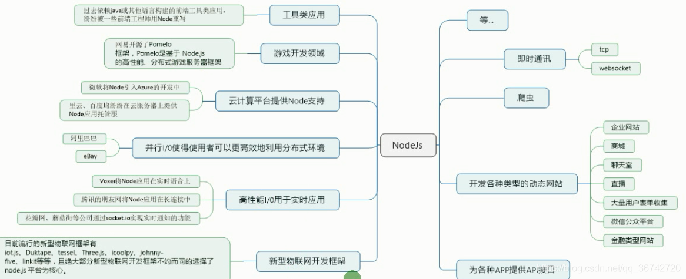
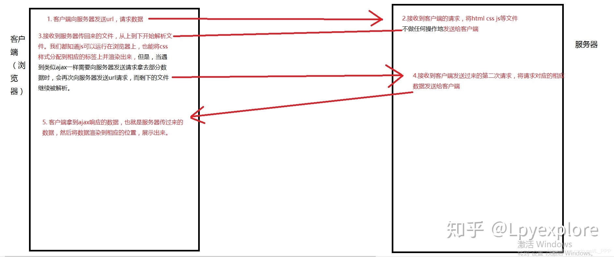
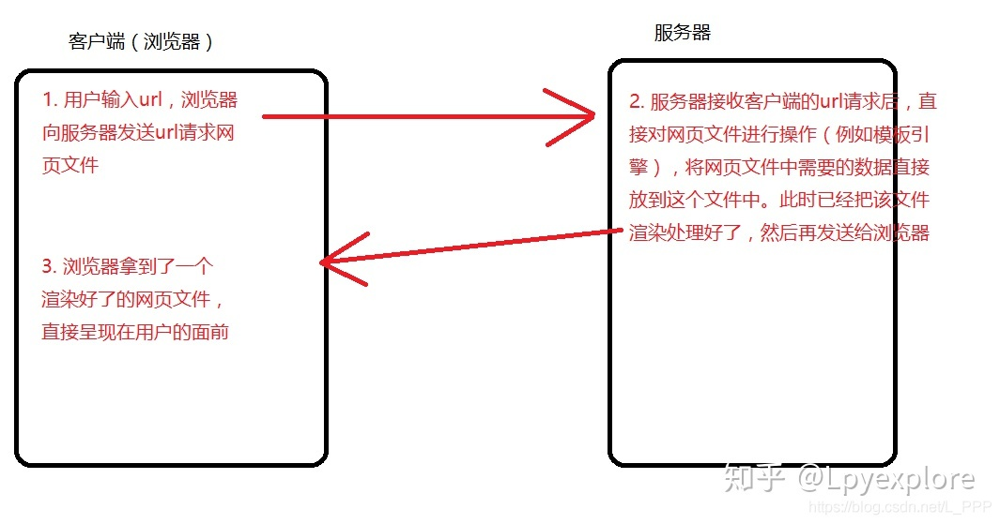
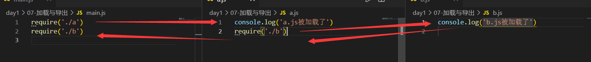

## 1 简介

### 1.1 什么是 Node.js？

Node.js 是一个**javascript 运行环境**。它让 javascript 可以开发后端程序，实现几乎其他后端语言实现的所有功能，可以与 PHP、Java、Python、.NET、Ruby 等后端语言平起平坐。

Nodejs 是基于**V8 引擎**，V8 是 Google 发布的**开源 JavaScript 引擎**，本身就是用于 Chrome 浏览器的 js 解释部分，但是 Ryan Dahl 这哥们，鬼才般的，把这个 V8 搬到了服务器上，用于做服务器的软件。

### 1.2 Node.js 能干什么？



### 1.3 学习目标

- B/S 编程模型
- 模块化编程
- Node 常用 API
- 异步编程(回调函数，promise，async)
- Express 开发框架
- ES6
- ...

## 2 起步

### 2.1 安装

官网链接：http://nodejs.cn/download/

### 2.2 Hello World

1. 创建 js 文件，例如`hello.js`
2. 打开终端，找到文件相应的目录，运行`node hello.js `

```javascript
console.log('hello world')
// 输出结果
hello world
```

**注意：**node.js 中没有 DOM 和 BOM，

### 2.3 文件读写

```javascript
// 浏览器中的js不能读取本地的文件（没有文件操作的能力）
// nodejs可以经行文件操作

// 1. 导入fs(file-system)这个包
var fs = require('fs')
// 2. 读写文件
/**********************************1.文件读取***********************************/
fs.readFile('./01-helloworld.js', (error, data) => {
  // 默认文件中读取的数据是二进制数据
  // 3.所以要用toString()转换为字符串
  console.log(data.toString())
})
/**********************************2.文件书写***********************************/
fs.writeFile('./test.txt', 'hello world', (error) => {
  console.log('文件写入成功')
  // 如果成功error则为空
  console.log(error)
})
```
### 2.4 创建服务器

```javascript
// 1.加载http核心模块
var http = require('http')

// 2.使用 http.createServer()创建serve实例，创建服务器
var serve = http.createServer()
var data = [
  {
    id: 1,
    title: 'hello',
  },
  {
    id: 2,
    title: 'xiaozhang',
  },
]

// 3.提供数据服务： 发请求->接受请求->处理请求->发送响应
// 当客户端请求过来时，就会自动触发服务器的request事件请求，然后执行第二个参数，回调处理
// request 请求事件处理函数，需要接受两个参数
//     Request:请求对象，获取客户端发过来的信息，例如请求路径
//     Response:响应对象，给客户端发送响应的信息
serve.on('request', (request, response) => {
  if (request.url === '/index') {
    // 使传到客户端的数据类型为UTF-8，防止乱码的问题，charset只对字符编码，其他类型的比如图片就可以不用转换
    // text/plain为文本，text/html可以解析html部分
    response.setHeader('Content-type', 'text/plain;charset=utf-8')
    response.end('欢迎来到小张的生活馆')
  } else if (request.url === '/home') {
    // 传输的值要为字符串，所以要用JSON.stringify()
    response.end(JSON.stringify(data))
  } else {
    console.log('收到客户端的请求了，请求路径为: ' + request.url)
    // response.write('要给客户端发送响应的数据')
    // write可以使用多次，但是最后一定要使用end来结束响应，否则客户端会一直处于等待状态
    response.write('hello \n xiaozhangtongx')
    // 告诉客户端，结束响应
    response.end()
  }
})

// 4.绑定端口号，启动服务器
serve.listen(9001, () => {
  console.log('服务器启动成功')
})
```

## 3 Node中的js

### 3.1 核心模块

- 官方的API文档：http://nodejs.cn/api/     常用的API如下：

```javascript
// 1.用来获取机器信息
var os = require('os')

// 2.用来操作路径
var path = require('path')

// 获取当前机器CPU的信息
console.log(os.cpus())

// memory 内存
console.log(os.totalmem())
```

### 3.2 用户自定义模块

- `require`是一个方法，它的作用就是用来加载模块

  在node中，模块化加载有**3种**：

  1.commonjs规范
  2.前端模块的规范 是Amd规范  ，代表就是requirejs，他是异步的，很多前端框架都用amd规范 如 jq angular 等
  3.es6 用的最多

- 模块的导入和导出

  > exports,require

  `b.js`

  ```javascript
  var test = '你好小张'
  
  // exports导出
  exports.test = test
  
  exports.add = (x, y) => {
    return x + y
  }
  
  ```

  `a.js`

  ```javascript
  // require方法有两个作用：
  //   1.加载文件并执行其中的方法
  //   2.拿到加载模块导出的接口
  
  var res = require('./b')
  console.log(res)
  // 输出一个对象
  console.log(res.test)
  // 输出“你好小张”
  console.log(res.add(10, 50))
  // 执行10+50，输出60
  ```

## 4 web服务器

### 4.1 IP地址和端口号

**IP地址来定位计算机**

**端口号来定位应用程序（所有联网通信的软件都需要端口号）**

**IP地址**是一个规定，现在使用的是IPv4，既由**4个0-255之间的数字组成**，在计算机内部存储时只需要4个字节即可。在计算机中，IP地址是分配给网卡的，每个网卡有一个唯一的IP地址，如果一个计算机有多个网卡，则该台计算机则拥有多个不同的IP地址，在同一个网络内部，IP地址不能相同。**IP地址的概念类似于电话号码、身份证这样的概念**。

其实在网络中只能使用IP地址进行数据传输，所以在传输以前，需要把域名转换为IP，这个由称作**DNS的服务器**专门来完成。 所以在网络编程中，可以使用IP或域名来标识网络上的一台设备。

 为了在一台设备上可以运行多个程序，人为的设计了**端口(Port)**的概念，类似的例子是公司内部的分机号码。规定一个设备有216个，也就是65536个端口，**每个端口对应一个唯一的程序**。每个网络程序，无论是客户端还是服务器端，都对应一个或多个特定的端口号。由于0-1024之间多被操作系统占用，所以**实际编程时一般采用1024以后的端口号**。 下面是一些常见的服务对应的端口：

> ftp：23，telnet：23，smtp：25，dns：53，http：80，https：443

使用端口号，可以找到一台设备上唯一的一个程序。 所以如果需要和某台计算机建立连接的话，只需要知道IP地址或域名即可，但是如果想和该台计算机上的某个程序交换数据的话，还必须知道该程序使用的端口号。

数据传输方式 在网络上，不管是有线传输还是无线传输，数据传输的方式有**两种**：

**TCP(Transfer Control Protocol) 传输控制协议**方式，该传输方式是一种**稳定可靠的传送方式**，类似于现实中的打电话。只需要建立一次连接，就可以多次传输数据。就像电话只需要拨一次号，就可以实现一直通话一样，如果你说的话不清楚，对方会要求你重复，保证传输的数据可靠。 使用该种方式的**优点是稳定可靠，缺点是建立连接和维持连接的代价高，传输速度不快**。

**UDP(User Datagram Protocol) 用户数据报协议**方式，该传输方式不建立稳定的连接，类似于发短信息。每次发送数据都直接发送。发送多条短信，就需要多次输入对方的号码。该传输方式不可靠，数据有可能收不到，系统只保证尽力发送。 使用该种方式的**优点是开销小，传输速度快，缺点是数据有可能会丢失**。

### 4.2 模板引擎 [art-template](http://aui.github.io/art-template/zh-cn)(感觉已经过时了)

  官方文档：[介绍 - art-template (aui.github.io)](http://aui.github.io/art-template/zh-cn/docs/)

-  **简介**

art-template 是一个简约、超快的模板引擎。它采用作用域预声明的技术来优化模板渲染速度，从而获得接近 JavaScript 极限的运行性能，并且同时支持 NodeJS 和浏览器

- **安装**

> npm install art-template --save

### 4.3 服务端渲染与客户端渲染

Node开启的服务器是黑盒子，所有的资源都不允许用户访问。

- **客户端渲染：**至少向服务器请求**两次**，类似于学校教务的系统 http://sso.jwc.whut.edu.cn/Certification/login.do

  

- **服务端渲染：** vue的前后端分离

  

参考链接：https://zhuanlan.zhihu.com/p/171579801

## 5 模块系统

### 5.1 什么是模块化

在NodeJs中，应用由模块组成，nodejs中采用commonJS模块规范。

- 一个js文件就是一个**模块**

- 每个模块都是一个独立的**作用域**，在这个而文件中定义的**变量、函数、对象都是私有的**，对其他文件不可见。

### 5.2 CommonJS模规范

#### 5.2.1 加载`require`

语法：

```javascript
var 自定义变量 = require('模块名称')
```

两个作用：

- 执行被加载模块中的代码
- 得到被加载模块中的`exports`导出接口对象

#### 5.2.2 导出`exports`

语法：

- **导出多个成员**（必须在对象中）

  ```javascript
  // 导出数字
  exports.a = 123
  
  // 导出函数
  exports.add = (x, y) => {
    return x + y
  }
  
  // 导出对象
  exports.obj = {
    name: 'xiaozhangtongx',
    age: 20,
    hobby: 'code',
  }
  ```

- **导出单个成员**（拿到的就是：函数和字符串）

  ```javascript
  module.exports = 'hello'
  
  // 注意若有多个module.exports，后者会覆盖前者
  module.exports = function (x, y) {
    return x + y
  }
  ```
  

#### 5.2.3 导出原理解析

`exports`是`module.exports`的一个引用

```javascript
// 无效
exports = 'tongxue'

// 有效
module.exports = 'tongxue'

// 有效 exports重新建立与module.exports的联系
exports = module.exports
```

```javascript
console.log(module.exports === exports)
// 输出为true
// 为了书写方便，通常在导出多个成员的时候直接用exports
// 而我们在return的时候，return的是module.exports不是exports
// 所以如果给module.exports重新赋值就不会被覆盖，如果没有重新赋值就会被覆盖return最后的那个成员
```

```javascript
exports.a = 'xiaozhang'

module.exports = 'tongxue'
// 输出结果为: tongxue
// 原因解释：而我们在return的时候，return的是module.exports不是exports
```

#### 5.4 require方法加载规则

- 优先从缓存中加载

  

  输出的结果

  >a.js被加载了
  >b.js被加载了

  由于在a.js里面已经加载了b,所以输出的的时候就**不会重复加载**，但是可以**拿到重复加载的对象**

- 判断模块标识符

### 5.3 npm
```bash
 npm install // 安装package.json定义好的模块，简写 npm i

 // 安装包指定模块
 npm i <ModuleName>

 // 全局安装
 npm i <ModuleName> -g 

 // 安装包的同时，将信息写入到package.json中的 dependencies 配置中
 npm i <ModuleName> --save

 // 安装包的同时，将信息写入到package.json中的 devDependencies 配置中
 npm i <ModuleName> --save-dev

 // 安装多模块
 npm i <ModuleName1> <ModuleName2>

 // 安装方式参数：
 -save // 简写-S，加入到生产依赖中
 -save-dev // 简写-D，加入到开发依赖中
 -g // 全局安装 将安装包放在 /usr/local 下或者你 node 的安装目录
```

npm详细命令可参考：https://blog.csdn.net/qq_43740362/article/details/118686494

## 6 Express

Express 是一个简洁而灵活的 node.js Web应用框架, 提供了一系列强大特性帮助你创建各种 Web 应用，和丰富的 HTTP 工具。

使用 Express 可以快速地搭建一个完整功能的网站。

> 官网链接：http://expressjs.com/

Express 框架核心特性：

- 可以设置中间件来响应 HTTP 请求
- 定义了路由表用于执行不同的 HTTP 请求动作
- 可以通过向模板传递参数来动态渲染 HTML 页面

### 6.1 初识Express

```javascript
// 0.安装
// cnpm install express --save
// 1.导包
var express = require('express')

// 2. 创建web服务器应用,类似与原来的http.createServer()
var app = express()

// 公开指定目录
app.use('/public/', express.static('./public/'))

// 当服务器收到get请求/时执行某个操作
// 返回一个字符串
app.get('/', (req, res) => {
  res.send('hello express')
})

// 返回一个页面(服务端渲染)
app.get('/home', (req, res) => {
  res.send(`
  <!DOCTYPE html>
<html lang="en">
  <head>
    <meta charset="UTF-8" />
    <meta http-equiv="X-UA-Compatible" content="IE=edge" />
    <meta name="viewport" content="width=device-width, initial-scale=1.0" />
    <title>Document</title>
  </head>
  <body>
    <h2>xiaozhang</h2>
    
  </body>
</html>
  `)
})

// 相当于server.listen
app.listen(3000, () => {
  console.log('app is running')
})
```

为了实现热部署的效果，可以使用`nodemon`这个热部工具

nodemon用来监视node.js应用程序中的任何更改并自动重启服务,非常适合用在开发环境中。

> // 全局安装
>
> npm install -g nodemon
>
> // 启动项目
>
> nodemon [your node app]

### 6.2 基本路由

Node.js 路由(router) 提供了 URL 请求路径到 Node.js 方法的一一**映射机制**

我们可以解析 HTTP 请求的 URL ，从 URL 中提取出请求的路径以及 GET/POST 参数

Node.js Web 应用程序所有的请求数据都被封装在 request 对象中，该对象作为 onRequest() 回调函数的第一个参数传递

我们可以使用 Node.js **url** 模块和 **querystring** 第三方模块来解析这些请求参数 :

1. Node.js **url** 模块可以解析 URL 参数信息
2. **querystring** 可以解析 POST 请求中放在 body(请求体中的参数)

**URL解析**

```http
                              url.parse(string).query
                                           |
           url.parse(string).pathname      |
                       |                   |
                       |                   |
                     ------ -------------------
http://localhost:8080/ss?name=twle&hello=world
                              ----       -----
                                |          |
                                |          |
querystring.parse(queryString)["name"]     |
                                           |
          querystring.parse(queryString)["hello"]
```

### 6.3 静态服务

通常在`public`子文件夹中包含图像，CSS等，然后将其公开到根目录：

```javascript
var express = require('express')

var app = express()

// 静态服务,如果第一个为'/'可以直接用
// app.use(express.static('./public/'))
// 通用
app.use('/public', express.static('./public/'))

app.get('/home', (req, res) => {
  res.send('hello')
})

app.listen(3000, () => {
  console.log('app is serve...')
})
```

### 6.4 配置模板引擎

#### 6.4.1 安装

```shell
npm install --save art-template
npm install --save express-art-template
```

#### 6.4.2 使用

```javascript
// 配置使用art-template模板引擎
app.engine('html', require('express-art-template'))

// express 为response响应对象提供了一个方法：render
// 当配置了模板引擎的时候，render就可以使用了
// render使用方法就是 res.render('html模板'，{模板数据})
// 第一个参数必须是views下的文件

app.get('/admin', (req, res) => {
  res.render('admin/index.html', {
    name: 'xiaozhangtx',
  })
})
```

#### 6.4.3 获取post请求体数据

>**req.query 只能用在get请求中**
>
>在Express缺少一个模块，所以要引入express的中间件 `body-parser`

- **安装**

  ```shell
  npm install --save body-parser
  ```

- [**配置**](http://expressjs.com/en/resources/middleware/body-parser.html)

  ```javascript
  var express = require('express')
  var bodyParser = require('body-parser')
  
  var app = express()
  
  // parse application/x-www-form-urlencoded
  app.use(bodyParser.urlencoded({ extended: false }))
  
  // parse application/json
  app.use(bodyParser.json())
  
  app.use(function (req, res) {
    res.setHeader('Content-Type', 'text/plain')
    res.write('you posted:\n')
    res.end(JSON.stringify(req.body, null, 2))
  })
  ```

#### 6.4.4 路由模块的设计

`router.js`

```javascript
var fs = require('fs')

// 1.导入express
var express = require('express')

// 2.创建路由容器
var router = express.Router()

// 3.把路由都挂载到router这个路由容器中
router.get('/student', (req, res) => {
  fs.readFile('./db.json', (error, data) => {
    if (error) {
      console.log('文件读取错误')
    } else {
      res.send(JSON.parse(data))
    }
  })
})

// 4.导出router容器
module.exports = router
```

`app.js`

```javascript
// 导入router.js
var router = require('./router')

var app = express()

// 把路由都挂载到app中
app.use(router)    
```

## 7 [MongoDB](https://www.runoob.com/mongodb/mongodb-tutorial.html)

MongoDB 是一个基于分布式文件存储的数据库。由 C++ 语言编写。旨在为 WEB 应用提供可扩展的高性能数据存储解决方案。MongoDB 是一个介于关系数据库和非关系数据库之间的产品，是非关系数据库当中功能最丰富，最像关系数据库的。

### 7.1 NoSQL

NoSQL(NoSQL = Not Only SQL )，意即"不仅仅是SQL"。在现代的计算系统上每天网络上都会产生庞大的数据量。这些数据有很大一部分是由关系数据库管理系统（RDBMS）来处理。 1970年 E.F.Codd's提出的关系模型的论文 "A relational model of data for large shared data banks"，这使得数据建模和应用程序编程更加简单。通过应用实践证明，关系模型是非常适合于客户服务器编程，远远超出预期的利益，今天它是结构化数据存储在网络和商务应用的主导技术。

### 7.2 安装

> 可以参考菜鸟教程，链接：https://www.runoob.com/mongodb/mongodb-window-install.html

### 7.3 Node中使用

#### 7.3.1 导入mongodb

>为了导入方便，这里使用了一个依赖包mongoose
>
>**mongoose简介：**
>
>中文网链接：http://mongoosejs.net/
>
>Mongoose 是一个让我们可以通过Node来操作MongoDB数据库的一个模块
>Mongoose 是一个对象文档模型（ODM）库，它是对Node原生的MongoDB模块进行了进一步的优化封装
>大多数情况下，他被用来把结构化的模式应用到一个MongoDB集合，并提供了验证和类型装换等好处
>基于MongoDB驱动，通过关系型数据库的思想来实现非关系型数据库

- mongoose官网例子

  ```javascript
  var mongoose = require('mongoose')
  var Schema = mongoose.Schema
  //连接数据库
  mongoose.connect('mongodb://localhost/student', {
    useNewUrlParser: true,
  })
  
  //监听数据库连接状态
  mongoose.connection.once('open', () => {
    console.log('数据库连接成功……')
  })
  mongoose.connection.once('close', () => {
    console.log('数据库断开……')
  })
  
  //创建Schema对象（约束）
  var stuSchema = new Schema({
    name: String,
    age: Number,
    gender: {
      type: String,
      default: 'male',
    },
    addr: String,
  })
  
  //将stuSchema映射到一个MongoDB collection并定义这个文档的构成
  var stuModle = mongoose.model('student', stuSchema)
  
  //向student数据库中插入数据
  stuModle.create(
    {
      name: '小明',
      age: '20',
      addr: '天津',
    },
    (err, docs) => {
      if (!err) {
        console.log('插入成功' + docs)
      }
    }
  )
  ```

#### 7.3.2 增添数据

```javascript
//向student数据库中插入数据
stuModle.create(
  {
    name: '小明',
    age: '20',
    addr: '天津',
  },
  (err, docs) => {
    if (!err) {
      console.log('插入成功' + docs)
    }
  }
)
```

#### 7.3.3 查看数据

#### 7.3.4 修改数据

#### 7.3.5 删除数据

详见官网

## 8 [中间件](https://www.w3cschool.cn/expressapi/expressapi-using-middleware.html)

> 中间件是介于应用系统和系统软件之间的一类软件，它使用系统软件所提供的基础服务（功能），衔接网络上应用系统的**各个部分**或**不同的应用**，能够达到资源共享、功能共享的目的。对请求进行预处理
>
> **参考文件**：https://www.jianshu.com/p/797a4e38fe77

### 中间件的作用

>多个中间件之间 

### 8.1**全局生效的中间件**

> app.use()的作用就是注册全局的中间件

```javascript
/**
 * express中间件的实现和执行顺序
 *
 * Created by BadWaka on 2017/3/6.
 */
var express = require('express')

var app = express()
app.listen(3000, function () {
  console.log('listen 3000...')
})

function middlewareA(req, res, next) {
  console.log('middlewareA before next()')
  next()
  console.log('middlewareA after next()')
}

function middlewareB(req, res, next) {
  console.log('middlewareB before next()')
  next()
  console.log('middlewareB after next()')
}

function middlewareC(req, res, next) {
  console.log('middlewareC before next()')
  next()
  console.log('middlewareC after next()')
}

app.use(middlewareA)
app.use(middlewareB)
app.use(middlewareC)
```

输出结果

简洁写法:

```javascript
app.use((req, res, next) => {
  console.log(hello)
  next()
})
```

### 8.2 局部生效的中间件

```javascript
const express = require('express')
const app = express()
const port = 3000

// 1.定义中间件函数
const mw1 = (req, res, next) => {
  console.log('调用了局部路由1')
  next()
}
const mw2 = (req, res, next) => {
  console.log('调用了局部路由2')
  next()
}
// 2.创建路由
app.get('/', [mw1, mw2], (req, res) => res.send('Hello World!'))
app.get('/home', (req, res) => res.send('Hello Xiaozhangtx!'))
app.listen(port, () => console.log(`Example app listening on port ${port}!`))
```

### 8.3 中间件的注意事项

- 中间件的注册一定要**路由之前**
- 客户端发送过来的请求，可以连续调用多个中间件来执行
- 执行中间价时不要忘记使用**next()函数**
- 为了防止代码混乱，在next()之后不要写其他的代码
- 共享req和res

### 8.4 中间件的分类

#### 8.4.1 应用级别中间件

通过`app.use()`或`app.get()`...**绑定到app实例上**的中间件

```javascript
var app = express();

// 没有挂载路径的中间件，应用的每个请求都会执行该中间件
app.use(function (req, res, next) {
  console.log('Time:', Date.now());
  next();
});

// 挂载至 /user/:id 的中间件，任何指向 /user/:id 的请求都会执行它
app.use('/user/:id', function (req, res, next) {
  console.log('Request Type:', req.method);
  next();
});

// 路由和句柄函数(中间件系统)，处理指向 /user/:id 的 GET 请求
app.get('/user/:id', function (req, res, next) {
  res.send('USER');
});
```

#### 8.4.2 路由级中间件

路由级中间件和应用级中间件一样，只是它绑定的对象为 `express.Router()`。**绑定到router实例上**

```javascript
var router = express.Router();
```

#### 8.4.3 错误处理中间件

错误处理中间件有 ***4* 个参数**，定义错误处理中间件时必须使用这 4 个参数。即使不需要 `next` 对象，也必须在签名中声明它，否则中间件会被识别为一个常规中间件，不能处理错误。

错误处理中间件和其他中间件定义类似，只是要使用 4 个参数，而不是 3 个，其签名如下： `(err, req, res, next)`

**注意：错误处理中间件一定要注册在所有的路由之后**

```javascript
app.use(function(err, req, res, next) {
  console.error(err.stack);
  res.status(500).send('Something broke!');
});
```

#### 8.4.4 内置中间件

自 `Express 4.16.0` 版本开始，`Express` 内置了 3 个常用的中间件，极大的提高了 `Express` 项目的开发效率和体验

1. `express.static` 快速托管静态资源的内置中间件，例如： HTML 文件、图片、`CSS` 样式等（无兼容性）
2. `express.json` 解析 `JSON` 格式的请求体数据（**有兼容性**，仅在 `4.16.0+` 版本中可用）
3. `express.urlencoded` 解析 `URL-encoded` 格式的请求体数据（**有兼容性**，仅在 `4.16.0+` 版本中可用）

- `express.json` 中间件的使用

1. `express.json()` 中间件，解析表单中的 `JSON` 格式的数据
2. 案例代码

```javascript
const  = require('express')
const app = express()

// 注意：除了错误级别的中间件，其他的中间件，必须在路由之前进行配置
// 通过 express.json() 这个中间件，解析表单中的 JSON 格式的数据
app.use(express.json())

app.post('/user', (req, res) => {
  // 在服务器，可以使用 req.body 这个属性，来接收客户端发送过来的请求体数据
  // 默认情况下，如果不配置解析表单数据中间件，则 req.body 默认等于 undefined
  console.log(req.body)
  res.send('ok')
})

app.listen(3000, () => {
  console.log('running……')
})
```

- `express.urlencoded` 中间件的使用

1. `express.urlencoded` 解析 `URL-encoded` 格式的请求体数据
2. 案例代码

```javascript
const express = require('express')
const app = express()

// 通过 express.urlencoded() 这个中间件，来解析表单中的 url-encoded 格式的数据
app.use(express.urlencoded({ extended: false }))

app.post('/book', (req, res) => {
  console.log(req.body)
  res.send(req.body)
})

app.listen(3000, () => {
  console.log('running……')
})
```

#### 8.4.5 第三方中间件

通过使用第三方中间件从而为 Express 应用增加更多功能。安装所需功能的 node 模块，并在应用中加载，可以在应用级加载，也可以在路由级加载。

例如前面所学的：`body-parser`

## 9 编写接口

### 9.1创件基本的服务器

### 9.2 编写接口

### 9.3 解决跨域

使用`cors`来解决跨域

> CORS是一个W3C标准，全称是"跨域资源共享"（Cross-origin resource sharing）。参考链接：http://www.ruanyifeng.com/blog/2016/04/cors.html

最后配置的的结果

- **app.js**

  ```javascript
  // 导入express
  const express = require('express')
  // 创建服务器实例
  const app = express()
  // 设置端口号
  const port = 8081
  
  // 配置表单数据的中间件
  app.use(express.urlencoded({ extends: false }))
  
  // 一定要在路由前配置cors来解决跨域问题
  const cors = require('cors')
  app.use(cors())
  
  // 导入路由模块
  const router = require('./router')
  // 注册到app中
  app.use('/api', router)
  
  // 监听端口
  app.listen(port, () => console.log(`app listening on port ${port}!`))
  
  ```

- **router.js**

  ```javascript
  const express = require('express')
  
  const router = express.Router()
  
  // 定义GET接口
  router.get('/get', (req, res) => {
    // 1. 通过req.query获取用户需要查询的数据
    const query = req.query
    // 2. 调用res.send()方法向客户端相应处理的结果
    res.send({
      status: 0, // 0表示成功，1表示失败
      msg: 'GET 请求成功', //
      data: query, // 响应给客户端的数据
    })
  })
  
  // 定义POST接口
  router.post('/post', (req, res) => {
    // 1. 通过req.body获取用户需要查询的数据
    const body = req.body
    // 2. 调用res.send()方法向客户端相应处理的结果
    res.send({
      status: 0, // 0表示成功，1表示失败
      msg: 'POST 请求成功', //
      data: body, // 响应给客户端的数据
    })
  })
  
  router.post('/update', function (req, res) {
    const { name, description } = req.body
    res.send(`Name ${name}, desc ${description}`)
  })
  
  module.exports = router
  ```

## 10 MySQL

### 10.1 安装

```shell
npm install mysql
```

### 10.2 配置mysql模块

```javascript
// 1.导入mysql模块
const mysql = require('mysql')

// 2.建立连接关系
const db = mysql.createConnection({
  host: '127.0.0.1', // 数据库的ip地址
  user: 'root', // 用户名
  password: 'root', // 用户名密码
  database: 'buyer', // 数据库名称
})
```

### 10.3 CRUD

```javascript
// 1.查询操作
db.query('SELECT * FROM goods', (err, res) => {
  // MySQL错误
  if (err) return console.log(err)
  // 数据sql执行的结果
  console.log(res)
})

// 2.新增操作
const user = { Uid: 111113, Upward: 123455 }
const sql = 'INSERT INTO user set ?'
db.query(sql, user, (err, res) => {
  // MySQL错误
  if (err) return console.log(err)
  // 数据sql执行的结果
  console.log(res)
})

// 3.修改操作
const user = { Uid: 111113, Upward: 123455 }
const sql = 'UPDATE USER SET ? WHERE user.`Uid` = ?  '
db.query(sql, [user, user.Uid], (err, res) => {
  // MySQL错误
  if (err) return console.log(err)
  // 数据sql执行的结果
  console.log(res)
})

// 4.删除数据
const sql = 'DELETE FROM USER WHERE user.`Uid` = ?'
const Uid = 111113
db.query(sql, Uid, (err, res) => {
  // MySQL错误
  if (err) return console.log(err)
  // 数据sql执行的结果
  console.log(res)
}) 
```

## 11 身份认证

> Session、Cookie、Token
>
> 参考链接：https://cloud.tencent.com/developer/article/1704064

### 11.1 **Cookie**

- **Cookie**不具有安全性，因此不建议服务器将重要的隐私数据通过Cookie发送给浏览器，**比如身份信息和密码**
- 不超过**4KB**
- 保存在**客户端**

### 11.2 **Session**

- 保存在**服务端**

```javascript
const express = require('express')
const app = express()
const port = 3000

// 1.导入session中间件
const session = require('express-session')

// 2.配置session中间件
app.use(
  session({
    secret: 'my_session_secret', // 建议使用 128 个字符的随机字符串
    resave: false, // 固定写法
    saveUninitialized: true, // 固定写法
  })
)

app.use(express.urlencoded({ extended: false }))

// 用户登录接口
app.post('/api/login', (req, res) => {
  // 判断提交的信息是否正确
  if (req.body.username !== 'admin' || req.body.password !== '123456') {
    return res.send({ status: 0, msg: '用户名或密码错误，请稍后再试' })
  }
  // 3.将登录成功后的信息保存到session中
  req.session.user = req.body // 用户信息
  req.session.islogin = true //用户状态
  res.send({ status: 1, msg: '登录成功' })
})

// 获取用户名接口
app.get('/api/username', (req, res) => {
  console.log(req.session)
  // 4. 从session中获取用户名称
  if (!req.session.islogin) {
    return res.send({ status: 0, msg: '请登录后再试' })
  }
  res.send({
    status: 0,
    msg: '获取成功',
    data: {
      username: req.session.user.username,
    },
  })
})

// 退出登录
app.post('/api/logout', (req, res) => {
  // 5.清空session信息(只会清空当前用户)
  req.session.destroy()
  res.send({ status: 1, msg: '退出登录成功' })
})

app.listen(port, () => console.log(`Example app listening on port ${port}!`))
```

### 11.3 **[JWT认证机制](https://www.jianshu.com/p/576dbf44b2ae)**

> Json web token (JWT), 是为了在网络应用环境间传递声明而执行的一种基于JSON的开放标准（[(RFC 7519](https://link.jianshu.com?t=https://tools.ietf.org/html/rfc7519)).该token被设计为紧凑且安全的，特别适用于分布式站点的单点登录（SSO）场景。JWT的声明一般被用来在身份提供者和服务提供者间传递被认证的用户身份信息，以便于从资源服务器获取资源，也可以增加一些额外的其它业务逻辑所必须的声明信息，该token也可直接被用于认证，也可被加密。
>
> **目前比较流行的跨域认证解决方案**

- 工作量流程

  > - 用户使用用户名密码来请求服务器
  > - 服务器进行验证用户的信息
  > - 服务器通过验证发送给用户一个token
  > - 客户端存储token，并在每次请求时附送上这个token值
  > - 服务端验证token值，并返回数据

- 信息保存到**客户端**
- **组成部分**
  - 头部（header)
  - 载荷（payload, 类似于飞机上承载的物品)
  - 签证（signature).

```javascript
const express = require('express')
const app = express()
const port = 3000

// 1. 导入生成JWT字符的包
const jwt = require('jsonwebtoken')
// 2. 导入将客户端发过来的JWT字符串解析还原成JSION对象的包
const expressJWT = require('express-jwt')
// 3. 定义secret密钥,对jwt进行加密和解密
const secrestKey = 'xiaozhangtx10101'

// 允许资源跨域
const cors = require('cors')
app.use(cors)

app.use(express.urlencoded({ extended: false }))

// 用户登录接口
app.post('/api/login', (req, res) => {
  // 判断提交的信息是否正确
  if (req.body.username !== 'admin' || req.body.password !== '123456') {
    return res.send({ status: 0, msg: '用户名或密码错误，请稍后再试' })
  }
  // 4. 调用jwt.sign()将用户信息加密成JWT字符串，相应给客户端
  res.send({ status: 1, msg: '登录成功' })
})
app.listen(port, () => console.log(`Example app listening on port ${port}!`))
```