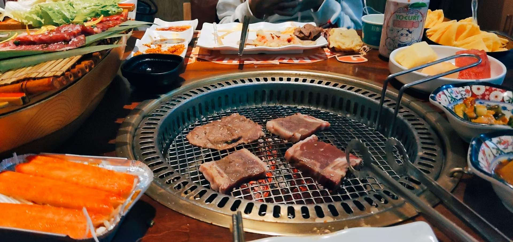

### 1.序言

> 现在是晚上 10 点 37 分，刚刚洗漱回来，坐在座位上不知道要干什么，但是又想做些啥（人就是这么的矛盾）。想到今天小汪的那些经历，我真的由衷的佩服小汪，想不到她居然经历了这么多的事情，同时也特别感谢她能信任我，能给我分享这些事情，然后又结合她的一些经历和我之前的一些经历，我突然想起了之前新华社的发布的一篇推文[七夕，珍惜](https://mp.weixin.qq.com/s/jjr8JnNCKR0YSESm0fom3Q)，总之，不管过去发生了什么事情，那都已经过去了，现在要做的就是珍惜当下，正如我高中老师所说的**人生最好的状态：既往不恋，当下不杂，未来不忧**

### 2.正文

> **珍惜遇见**
>
> _世间所有相遇，都是久别重逢。 懂得珍惜，才配拥有。_
>
> 这世上最遗憾的，不是我们走散了，而是我们本可以。
>
> 人间匆匆几十载，无论爱与不爱，下辈子我们都不会再见了。
>
> _愿余生，做个知足感恩的人，感恩每一份拥有，珍惜每一段缘分，别等到对你好的人被弄丢了，才追悔莫及。_
>
> **珍惜自己**
>
> 人生就是一场不断与遗憾握手言和的旅途。
>
> 我们要在这一程中，寻找真实的自己，坦然地面对自己的优缺点，慢慢地与内心那个很脆弱又很强大的自己和解。
>
> 要记得，_你是这世上独一无二的风景_。
>
> **珍惜家人**
>
> 年岁渐长，越来越觉得，再没有什么比一家人健健康康地在一起更幸福的事了。
>
> 以前总想去看看诗和远方，后来才发现自己最挂心的，永远是家乡里的那片田野，那里站着父亲母亲，还有少年时自己的影子。
>
> _这世上最爱你、最为你着想的，永远是家人_。
>
> 多打打电话，常回家看看，别给自己留下“子欲养而亲不待”的遗憾。
>
> **珍惜挚友**
>
> 记得看过一个问题，真正的朋友是什么样子的？有个很赞的回答这样说：“_不必经常联系，因为不曾忘记。_”
>
> 在不同的人生阶段，我们会遇到不同的人，融入到不同的圈子，过上不太一样的生活，但那些给过你温暖和陪伴的朋友，无论什么时候，都别忘了。
>
> 要感谢那些老朋友，陪你哭过陪你笑过，陪你疯过陪你醉过。
>
> 愿在彼此遥远的身边互相陪伴，熠熠生辉。
>
> **珍惜时光**
>
> 人生有三样东西无法挽留， 时间、生命和爱。
>
> _谁也无法阻挡时间长河的流淌，我们能做的，就只有珍惜自己手里拥有的时光_。
>
> 一生不长，去掉吃饭睡觉等必要生活日常，去掉工作等生存需求，再去掉一些社交应酬，一些留给家庭的时间，最后真正属于我们自己的，真的没多少。
>
> 没事早点睡，有空多读书、多赚钱、多成长自己，让当下的自己，不断靠近自己想要的生活。
>
> 该珍惜的就好好握着，该舍弃的就早点放下，学会给生活做减法，时刻记得：过日子过的是以后，不是以前。
>
> **珍惜健康**
>
> 人生下半场，拼的是健康。就像很多人说的，你所拥有的那些东西，就像一串串的 0，健康的自己才是最前面的 1，没了健康，再多的拥有，也是 0。
>
> 别总顾着低头往前走，要养成好的作息和锻炼的好习惯，跑步、瑜伽、打球，什么都好，人是需要运动的。
>
> _按时成长的同时，请保持温柔和可爱。好好爱自己，从当下开始_。
>
> **珍惜爱人**
>
> 伴侣，是这个世上与我们没有血缘关系，却最亲最近的一个人。
>
> 对另一半，少点苛责，少点抱怨，多点理解和尊重，多点夸奖和赞美，多点微笑和拥抱，生活真的会变美好很多。
>
> 老来总健忘，唯不忘相思，再用力地去爱去珍惜，也只有这几十年的光阴。
>
> _余生漫漫，记得珍惜爱人，珍惜爱情，珍惜人生中，最特别的缘分_。
>
> 所谓“七夕”，是普通的一天，但也是不普通的一天。我们需要仪式感，来使我们的人生，变得不那么平淡。
>
> 接下来，把每一个当下，都当作最好的开始。

### 3. 有感

人生路漫漫，道阻且长。这一生，会享受阳光的照拂，也会经历风雨的洗礼。会有不期而遇的温暖，也会有旦夕祸福的叵测。有些路，终要自己一个人走，是平坦，是泥泞，都不能回头。有些苦，只能自己默默品尝，熬过去了，就成长了。那些曾以为走不出来的困境，终会跨越。那些曾以为攀登不了的高峰，终会登顶。那些曾以为无法忘却的悲伤，终有一天会风轻云淡。珍惜所有的陌路相逢，看淡所有的不欢而散。人生最好的态度便是：**既往不恋，当下不杂，未来不忧**。希望我们俩都能这样吧！（反正这篇文章，她大概率也看不到，其实我今天想最后在逛街的时候牵你的手的，但是我还是有点怂，总之，今天我真的很感动，你能对我说你经历的事情，然后也由衷的我们的未来会更好，**既往不恋，当下不杂，未来不忧**）

