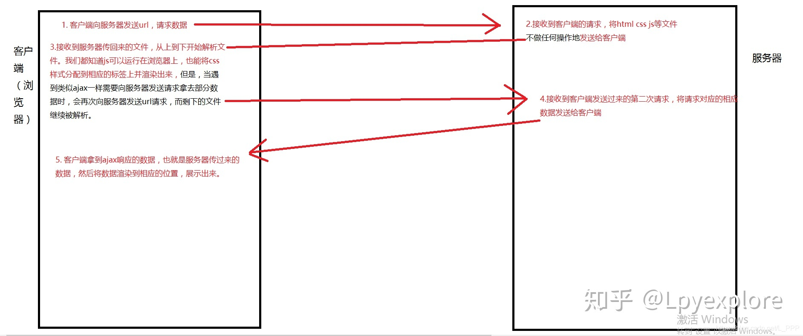
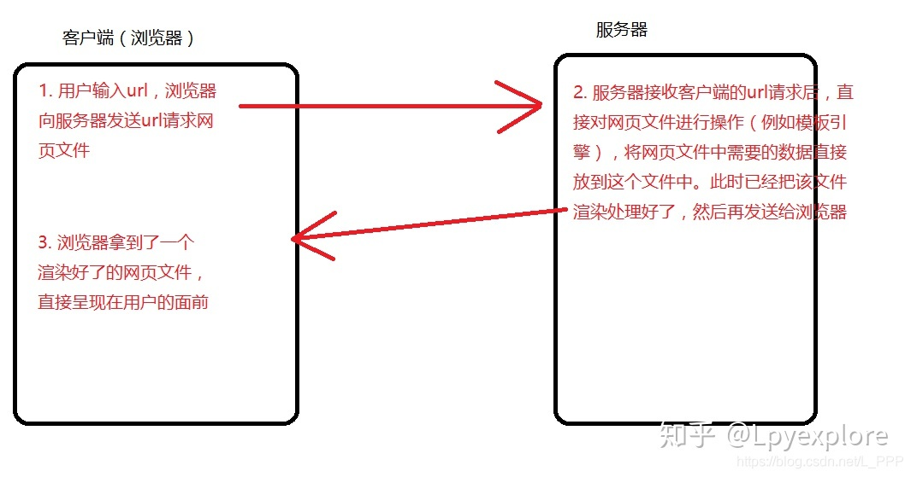
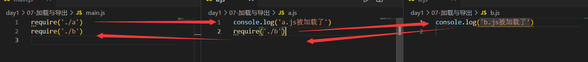

---

title: NodeJs学习笔记
date: 2022-01-10 08:48:57
tags: [前端, NodeJs]
---

# Node.js

## 1 简介

### 1.1 什么是 Node.js？

Node.js 是一个**javascript 运行环境**。它让 javascript 可以开发后端程序，实现几乎其他后端语言实现的所有功能，可以与 PHP、Java、Python、.NET、Ruby 等后端语言平起平坐。

Nodejs 是基于**V8 引擎**，V8 是 Google 发布的**开源 JavaScript 引擎**，本身就是用于 Chrome 浏览器的 js 解释部分，但是 Ryan Dahl 这哥们，鬼才般的，把这个 V8 搬到了服务器上，用于做服务器的软件。

### 1.2 Node.js 能干什么？


### 1.3 学习目标

- B/S 编程模型
- 模块化编程
- Node 常用 API
- 异步编程(回调函数，promise，async)
- Express 开发框架
- ES6
- ...

## 2 起步

### 2.1 安装

官网链接：http://nodejs.cn/download/

### 2.2 Hello World

1. 创建 js 文件，例如`hello.js`
2. 打开终端，找到文件相应的目录，运行`node hello.js `

```javascript
console.log('hello world')
// 输出结果
hello world
```

**注意：**node.js 中没有 DOM 和 BOM，

### 2.3 文件读写

```javascript
// 浏览器中的js不能读取本地的文件（没有文件操作的能力）
// nodejs可以经行文件操作

// 1. 导入fs(file-system)这个包
var fs = require('fs')
// 2. 读写文件
/**********************************1.文件读取***********************************/
fs.readFile('./01-helloworld.js', (error, data) => {
  // 默认文件中读取的数据是二进制数据
  // 3.所以要用toString()转换为字符串
  console.log(data.toString())
})
/**********************************2.文件书写***********************************/
fs.writeFile('./test.txt', 'hello world', (error) => {
  console.log('文件写入成功')
  // 如果成功error则为空
  console.log(error)
})
```
### 2.4 创建服务器

```javascript
// 1.加载http核心模块
var http = require('http')

// 2.使用 http.createServer()创建serve实例，创建服务器
var serve = http.createServer()
var data = [
  {
    id: 1,
    title: 'hello',
  },
  {
    id: 2,
    title: 'xiaozhang',
  },
]

// 3.提供数据服务： 发请求->接受请求->处理请求->发送响应
// 当客户端请求过来时，就会自动触发服务器的request事件请求，然后执行第二个参数，回调处理
// request 请求事件处理函数，需要接受两个参数
//     Request:请求对象，获取客户端发过来的信息，例如请求路径
//     Response:响应对象，给客户端发送响应的信息
serve.on('request', (request, response) => {
  if (request.url === '/index') {
    // 使传到客户端的数据类型为UTF-8，防止乱码的问题，charset只对字符编码，其他类型的比如图片就可以不用转换
    // text/plain为文本，text/html可以解析html部分
    response.setHeader('Content-type', 'text/plain;charset=utf-8')
    response.end('欢迎来到小张的生活馆')
  } else if (request.url === '/home') {
    // 传输的值要为字符串，所以要用JSON.stringify()
    response.end(JSON.stringify(data))
  } else {
    console.log('收到客户端的请求了，请求路径为: ' + request.url)
    // response.write('要给客户端发送响应的数据')
    // write可以使用多次，但是最后一定要使用end来结束响应，否则客户端会一直处于等待状态
    response.write('hello \n xiaozhangtongx')
    // 告诉客户端，结束响应
    response.end()
  }
})

// 4.绑定端口号，启动服务器
serve.listen(9001, () => {
  console.log('服务器启动成功')
})
```

## 3 Node中的js

### 3.1 核心模块

- 官方的API文档：http://nodejs.cn/api/     常用的API如下：

```javascript
// 1.用来获取机器信息
var os = require('os')

// 2.用来操作路径
var path = require('path')

// 获取当前机器CPU的信息
console.log(os.cpus())

// memory 内存
console.log(os.totalmem())
```

### 3.2 用户自定义模块

- `require`是一个方法，它的作用就是用来加载模块

  在node中，模块化加载有**3种**：

  1.commonjs规范
  2.前端模块的规范 是Amd规范  ，代表就是requirejs，他是异步的，很多前端框架都用amd规范 如 jq angular 等
  3.es6 用的最多

- 模块的导入和导出

  > exports,require

  `b.js`

  ```javascript
  var test = '你好小张'
  
  // exports导出
  exports.test = test
  
  exports.add = (x, y) => {
    return x + y
  }
  
  ```

  `a.js`

  ```javascript
  // require方法有两个作用：
  //   1.加载文件并执行其中的方法
  //   2.拿到加载模块导出的接口
  
  var res = require('./b')
  console.log(res)
  // 输出一个对象
  console.log(res.test)
  // 输出“你好小张”
  console.log(res.add(10, 50))
  // 执行10+50，输出60
  ```

## 4 web服务器

### 4.1 IP地址和端口号

**IP地址来定位计算机**

**端口号来定位应用程序（所有联网通信的软件都需要端口号）**

**IP地址**是一个规定，现在使用的是IPv4，既由**4个0-255之间的数字组成**，在计算机内部存储时只需要4个字节即可。在计算机中，IP地址是分配给网卡的，每个网卡有一个唯一的IP地址，如果一个计算机有多个网卡，则该台计算机则拥有多个不同的IP地址，在同一个网络内部，IP地址不能相同。**IP地址的概念类似于电话号码、身份证这样的概念**。

其实在网络中只能使用IP地址进行数据传输，所以在传输以前，需要把域名转换为IP，这个由称作**DNS的服务器**专门来完成。 所以在网络编程中，可以使用IP或域名来标识网络上的一台设备。

 为了在一台设备上可以运行多个程序，人为的设计了**端口(Port)**的概念，类似的例子是公司内部的分机号码。规定一个设备有216个，也就是65536个端口，**每个端口对应一个唯一的程序**。每个网络程序，无论是客户端还是服务器端，都对应一个或多个特定的端口号。由于0-1024之间多被操作系统占用，所以**实际编程时一般采用1024以后的端口号**。 下面是一些常见的服务对应的端口：

> ftp：23，telnet：23，smtp：25，dns：53，http：80，https：443

使用端口号，可以找到一台设备上唯一的一个程序。 所以如果需要和某台计算机建立连接的话，只需要知道IP地址或域名即可，但是如果想和该台计算机上的某个程序交换数据的话，还必须知道该程序使用的端口号。

数据传输方式 在网络上，不管是有线传输还是无线传输，数据传输的方式有**两种**：

**TCP(Transfer Control Protocol) 传输控制协议**方式，该传输方式是一种**稳定可靠的传送方式**，类似于现实中的打电话。只需要建立一次连接，就可以多次传输数据。就像电话只需要拨一次号，就可以实现一直通话一样，如果你说的话不清楚，对方会要求你重复，保证传输的数据可靠。 使用该种方式的**优点是稳定可靠，缺点是建立连接和维持连接的代价高，传输速度不快**。

**UDP(User Datagram Protocol) 用户数据报协议**方式，该传输方式不建立稳定的连接，类似于发短信息。每次发送数据都直接发送。发送多条短信，就需要多次输入对方的号码。该传输方式不可靠，数据有可能收不到，系统只保证尽力发送。 使用该种方式的**优点是开销小，传输速度快，缺点是数据有可能会丢失**。

### 4.2 模板引擎 [art-template](http://aui.github.io/art-template/zh-cn)(感觉已经过时了)

  官方文档：[介绍 - art-template (aui.github.io)](http://aui.github.io/art-template/zh-cn/docs/)

-  **简介**

art-template 是一个简约、超快的模板引擎。它采用作用域预声明的技术来优化模板渲染速度，从而获得接近 JavaScript 极限的运行性能，并且同时支持 NodeJS 和浏览器

- **安装**

> npm install art-template --save

### 4.3 服务端渲染与客户端渲染

Node开启的服务器是黑盒子，所有的资源都不允许用户访问。

- **客户端渲染：**至少向服务器请求**两次**，类似于学校教务的系统 http://sso.jwc.whut.edu.cn/Certification/login.do

  

- **服务端渲染：** vue的前后端分离

  

参考链接：https://zhuanlan.zhihu.com/p/171579801

## 5 模块系统

### 5.1 什么是模块化

在NodeJs中，应用由模块组成，nodejs中采用commonJS模块规范。

- 一个js文件就是一个**模块**

- 每个模块都是一个独立的**作用域**，在这个而文件中定义的**变量、函数、对象都是私有的**，对其他文件不可见。

### 5.2 CommonJS模规范

#### 5.2.1 加载`require`

语法：

```javascript
var 自定义变量 = require('模块名称')
```

两个作用：

- 执行被加载模块中的代码
- 得到被加载模块中的`exports`导出接口对象

#### 5.2.2 导出`exports`

语法：

- **导出多个成员**（必须在对象中）

  ```javascript
  // 导出数字
  exports.a = 123
  
  // 导出函数
  exports.add = (x, y) => {
    return x + y
  }
  
  // 导出对象
  exports.obj = {
    name: 'xiaozhangtongx',
    age: 20,
    hobby: 'code',
  }
  ```

- **导出单个成员**（拿到的就是：函数和字符串）

  ```javascript
  module.exports = 'hello'
  
  // 注意若有多个module.exports，后者会覆盖前者
  module.exports = function (x, y) {
    return x + y
  }
  ```
  

#### 5.2.3 导出原理解析

`exports`是`module.exports`的一个引用

```javascript
// 无效
exports = 'tongxue'

// 有效
module.exports = 'tongxue'

// 有效 exports重新建立与module.exports的联系
exports = module.exports
```

```javascript
console.log(module.exports === exports)
// 输出为true
// 为了书写方便，通常在导出多个成员的时候直接用exports
// 而我们在return的时候，return的是module.exports不是exports
// 所以如果给module.exports重新赋值就不会被覆盖，如果没有重新赋值就会被覆盖return最后的那个成员
```

```javascript
exports.a = 'xiaozhang'

module.exports = 'tongxue'
// 输出结果为: tongxue
// 原因解释：而我们在return的时候，return的是module.exports不是exports
```

#### 5.4 require方法加载规则

- 优先从缓存中加载

  

  输出的结果

  >a.js被加载了
  >b.js被加载了

  由于在a.js里面已经加载了b,所以输出的的时候就**不会重复加载**，但是可以**拿到重复加载的对象**

- 判断模块标识符

### 5.3 npm

> npm install // 安装package.json定义好的模块，简写 npm i
>
> // 安装包指定模块
> npm i <ModuleName>
>
> // 全局安装
> npm i <ModuleName> -g 
>
> // 安装包的同时，将信息写入到package.json中的 dependencies 配置中
> npm i <ModuleName> --save
>
> // 安装包的同时，将信息写入到package.json中的 devDependencies 配置中
> npm i <ModuleName> --save-dev
>
> // 安装多模块
> npm i <ModuleName1> <ModuleName2>
>
> // 安装方式参数：
> -save // 简写-S，加入到生产依赖中
> -save-dev // 简写-D，加入到开发依赖中
> -g // 全局安装 将安装包放在 /usr/local 下或者你 node 的安装目录

npm详细命令可参考：https://blog.csdn.net/qq_43740362/article/details/118686494

## 6 Express

Express 是一个简洁而灵活的 node.js Web应用框架, 提供了一系列强大特性帮助你创建各种 Web 应用，和丰富的 HTTP 工具。

使用 Express 可以快速地搭建一个完整功能的网站。

> 官网链接：http://expressjs.com/

Express 框架核心特性：

- 可以设置中间件来响应 HTTP 请求
- 定义了路由表用于执行不同的 HTTP 请求动作
- 可以通过向模板传递参数来动态渲染 HTML 页面

### 6.1 初识Express

```javascript
// 0.安装
// cnpm install express --save
// 1.导包
var express = require('express')

// 2. 创建web服务器应用,类似与原来的http.createServer()
var app = express()

// 公开指定目录
app.use('/public/', express.static('./public/'))

// 当服务器收到get请求/时执行某个操作
// 返回一个字符串
app.get('/', (req, res) => {
  res.send('hello express')
})

// 返回一个页面(服务端渲染)
app.get('/home', (req, res) => {
  res.send(`
  <!DOCTYPE html>
<html lang="en">
  <head>
    <meta charset="UTF-8" />
    <meta http-equiv="X-UA-Compatible" content="IE=edge" />
    <meta name="viewport" content="width=device-width, initial-scale=1.0" />
    <title>Document</title>
  </head>
  <body>
    <h2>xiaozhang</h2>
    
  </body>
</html>
  `)
})

// 相当于server.listen
app.listen(3000, () => {
  console.log('app is running')
})
```

为了实现热部署的效果，可以使用`nodemon`这个热部工具

nodemon用来监视node.js应用程序中的任何更改并自动重启服务,非常适合用在开发环境中。

> // 全局安装
>
> npm install -g nodemon
>
> // 启动项目
>
> nodemon [your node app]

### 6.2 基本路由

Node.js 路由(router) 提供了 URL 请求路径到 Node.js 方法的一一**映射机制**

我们可以解析 HTTP 请求的 URL ，从 URL 中提取出请求的路径以及 GET/POST 参数

Node.js Web 应用程序所有的请求数据都被封装在 request 对象中，该对象作为 onRequest() 回调函数的第一个参数传递

我们可以使用 Node.js **url** 模块和 **querystring** 第三方模块来解析这些请求参数 :

1. Node.js **url** 模块可以解析 URL 参数信息
2. **querystring** 可以解析 POST 请求中放在 body(请求体中的参数)

**URL解析**

```http
                              url.parse(string).query
                                           |
           url.parse(string).pathname      |
                       |                   |
                       |                   |
                     ------ -------------------
http://localhost:8080/ss?name=twle&hello=world
                              ----       -----
                                |          |
                                |          |
querystring.parse(queryString)["name"]     |
                                           |
          querystring.parse(queryString)["hello"]
```

### 6.3 静态服务

通常在`public`子文件夹中包含图像，CSS等，然后将其公开到根目录：

```javascript
var express = require('express')

var app = express()

// 静态服务,如果第一个为'/'可以直接用
// app.use(express.static('./public/'))
// 通用
app.use('/public', express.static('./public/'))

app.get('/home', (req, res) => {
  res.send('hello')
})

app.listen(3000, () => {
  console.log('app is serve...')
})
```

### 6.4 配置模板引擎

#### 6.4.1 安装

```shell
npm install --save art-template
npm install --save express-art-template
```

#### 6.4.2 使用

```javascript
// 配置使用art-template模板引擎
app.engine('html', require('express-art-template'))

// express 为response响应对象提供了一个方法：render
// 当配置了模板引擎的时候，render就可以使用了
// render使用方法就是 res.render('html模板'，{模板数据})
// 第一个参数必须是views下的文件

app.get('/admin', (req, res) => {
  res.render('admin/index.html', {
    name: 'xiaozhangtx',
  })
})
```

#### 6.4.3 获取post请求体数据

>**req.query 只能用在get请求中**
>
>在Express缺少一个模块，所以要引入express的中间件 `body-parser`

- **安装**

  ```shell
  npm install --save body-parser
  ```

- [**配置**](http://expressjs.com/en/resources/middleware/body-parser.html)

  ```javascript
  var express = require('express')
  var bodyParser = require('body-parser')
  
  var app = express()
  
  // parse application/x-www-form-urlencoded
  app.use(bodyParser.urlencoded({ extended: false }))
  
  // parse application/json
  app.use(bodyParser.json())
  
  app.use(function (req, res) {
    res.setHeader('Content-Type', 'text/plain')
    res.write('you posted:\n')
    res.end(JSON.stringify(req.body, null, 2))
  })
  ```

#### 6.4.4 路由模块的设计

`router.js`

```javascript
var fs = require('fs')

// 1.导入express
var express = require('express')

// 2.创建路由容器
var router = express.Router()

// 3.把路由都挂载到router这个路由容器中
router.get('/student', (req, res) => {
  fs.readFile('./db.json', (error, data) => {
    if (error) {
      console.log('文件读取错误')
    } else {
      res.send(JSON.parse(data))
    }
  })
})

// 4.导出router容器
module.exports = router
```

`app.js`

```javascript
// 导入router.js
var router = require('./router')

var app = express()

// 把路由都挂载到app中
app.use(router)    
```

## 7 [MongoDB](https://www.runoob.com/mongodb/mongodb-tutorial.html)

MongoDB 是一个基于分布式文件存储的数据库。由 C++ 语言编写。旨在为 WEB 应用提供可扩展的高性能数据存储解决方案。MongoDB 是一个介于关系数据库和非关系数据库之间的产品，是非关系数据库当中功能最丰富，最像关系数据库的。

### 7.1 NoSQL

NoSQL(NoSQL = Not Only SQL )，意即"不仅仅是SQL"。在现代的计算系统上每天网络上都会产生庞大的数据量。这些数据有很大一部分是由关系数据库管理系统（RDBMS）来处理。 1970年 E.F.Codd's提出的关系模型的论文 "A relational model of data for large shared data banks"，这使得数据建模和应用程序编程更加简单。通过应用实践证明，关系模型是非常适合于客户服务器编程，远远超出预期的利益，今天它是结构化数据存储在网络和商务应用的主导技术。

### 7.2 安装

> 可以参考菜鸟教程，链接：https://www.runoob.com/mongodb/mongodb-window-install.html

### 7.3 Node中使用

#### 7.3.1 导入mongodb

>为了导入方便，这里使用了一个依赖包mongoose
>
>**mongoose简介：**
>
>中文网链接：http://mongoosejs.net/
>
>Mongoose 是一个让我们可以通过Node来操作MongoDB数据库的一个模块
>Mongoose 是一个对象文档模型（ODM）库，它是对Node原生的MongoDB模块进行了进一步的优化封装
>大多数情况下，他被用来把结构化的模式应用到一个MongoDB集合，并提供了验证和类型装换等好处
>基于MongoDB驱动，通过关系型数据库的思想来实现非关系型数据库

- mongoose官网例子

  ```javascript
  var mongoose = require('mongoose')
  var Schema = mongoose.Schema
  //连接数据库
  mongoose.connect('mongodb://localhost/student', {
    useNewUrlParser: true,
  })
  
  //监听数据库连接状态
  mongoose.connection.once('open', () => {
    console.log('数据库连接成功……')
  })
  mongoose.connection.once('close', () => {
    console.log('数据库断开……')
  })
  
  //创建Schema对象（约束）
  var stuSchema = new Schema({
    name: String,
    age: Number,
    gender: {
      type: String,
      default: 'male',
    },
    addr: String,
  })
  
  //将stuSchema映射到一个MongoDB collection并定义这个文档的构成
  var stuModle = mongoose.model('student', stuSchema)
  
  //向student数据库中插入数据
  stuModle.create(
    {
      name: '小明',
      age: '20',
      addr: '天津',
    },
    (err, docs) => {
      if (!err) {
        console.log('插入成功' + docs)
      }
    }
  )
  ```

#### 7.3.2 增添数据

```javascript
//向student数据库中插入数据
stuModle.create(
  {
    name: '小明',
    age: '20',
    addr: '天津',
  },
  (err, docs) => {
    if (!err) {
      console.log('插入成功' + docs)
    }
  }
)
```

#### 7.3.3 查看数据


#### 7.3.4 修改数据

#### 7.3.5 删除数据

2022 年 1 月 17 日更新                                                     