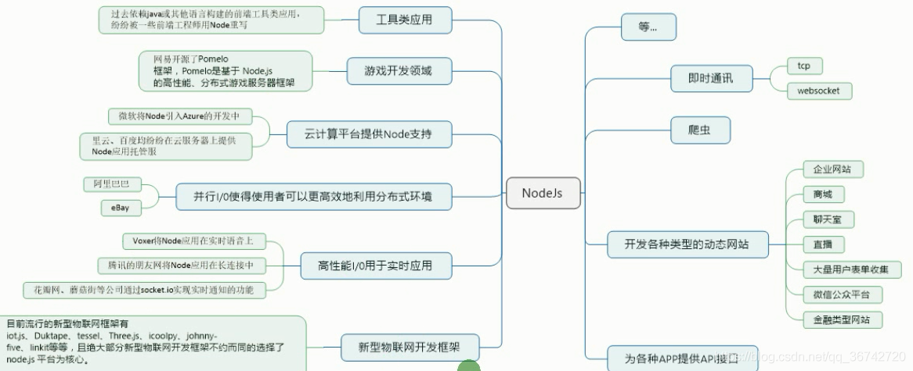

---

title: NodeJs学习笔记
date: 2022-01-10 08:48:57
tags: [前端, NodeJs]
---

# Node.js

## 1 简介

### 1.1 什么是 Node.js？

Node.js 是一个**javascript 运行环境**。它让 javascript 可以开发后端程序，实现几乎其他后端语言实现的所有功能，可以与 PHP、Java、Python、.NET、Ruby 等后端语言平起平坐。

Nodejs 是基于**V8 引擎**，V8 是 Google 发布的**开源 JavaScript 引擎**，本身就是用于 Chrome 浏览器的 js 解释部分，但是 Ryan Dahl 这哥们，鬼才般的，把这个 V8 搬到了服务器上，用于做服务器的软件。

### 1.2 Node.js 能干什么？



### 1.3 学习目标：

- B/S 编程模型
- 模块化编程
- Node 常用 API
- 异步编程(回调函数，promise，async)
- Express 开发框架
- ES6
- ...

## 2 起步

### 2.1 安装

官网链接：http://nodejs.cn/download/

### 2.2 Hello World

1. 创建 js 文件，例如`hello.js`
2. 打开终端，找到文件相应的目录，运行`node hello.js `

```javascript
console.log('hello world')
// 输出结果
hello world
```

**注意：**node.js 中没有 DOM 和 BOM，

### 2.3 文件读写

```javascript
// 浏览器中的js不能读取本地的文件（没有文件操作的能力）
// nodejs可以经行文件操作

// 1. 导入fs(file-system)这个包
var fs = require('fs')
// 2. 读写文件
/**********************************1.文件读取***********************************/
fs.readFile('./01-helloworld.js', (error, data) => {
  // 默认文件中读取的数据是二进制数据
  // 3.所以要用toString()转换为字符串
  console.log(data.toString())
})
/**********************************2.文件书写***********************************/
fs.writeFile('./test.txt', 'hello world', (error) => {
  console.log('文件写入成功')
  // 如果成功error则为空
  console.log(error)
})
```
### 2.4 创建服务器

```javascript
// 1.加载http核心模块
var http = require('http')

// 2.使用 http.createServer()创建serve实例，创建服务器
var serve = http.createServer()

// 3.提供数据服务： 发请求->接受请求->处理请求->发送响应
// 当客户端请求过来时，就会自动触发服务器的request事件请求，然后执行第二个参数，回调处理
// request 请求事件处理函数，需要接受两个参数
//     Request:请求对象，获取客户端发过来的信息，例如请求路径
//     Response:响应对象，给客户端发送响应的信息
serve.on('request', (request, response) => {
  if (request.url === '/index') {
    response.end('index')
  } else if (request.url === '/login') {
    response.end('login')
  } else {
    console.log('收到客户端的请求了，请求路径为: ' + request.url)
    // response.write('要给客户端发送响应的数据')
    // write可以使用多次，但是最后一定要使用end来结束响应，否则客户端会一直处于等待状态
    response.write('hello xiaozhangtongx')
    // 告诉客户端，结束响应
    response.end()
  }
})

// 4.绑定端口号，启动服务器
serve.listen(9001, () => {
  console.log('服务器启动成功')
})
```

## 3.Node中的js

### 3.1 核心模块

- 官方的API文档：http://nodejs.cn/api/     常用的API如下：

```javascript
// 1.用来获取机器信息
var os = require('os')

// 2.用来操作路径
var path = require('path')

// 获取当前机器CPU的信息
console.log(os.cpus())

// memory 内存
console.log(os.totalmem())
```

### 3.2 用户自定义模块

- `require`是一个方法，它的作用就是用来加载模块

  在node中，模块化加载有**3种**：

  1.commonjs规范
  2.前端模块的规范 是Amd规范  ，代表就是requirejs，他是异步的，很多前端框架都用amd规范 如 jq angular 等
  3.es6 用的最多

- 模块的导入和导出

  `exports,require`

  `b.js`

  ```javascript
  var test = '你好小张'
  
  // exports导出
  exports.test = test
  
  exports.add = (x, y) => {
    return x + y
  }
  
  ```

  `a.js`

  ```javascript
  // require方法有两个作用：
  //   1.加载文件并执行其中的方法
  //   2.拿到加载模块导出的接口
  
  var res = require('./b')
  console.log(res)
  // 输出一个对象
  console.log(res.test)
  // 输出“你好小张”
  console.log(res.add(10, 50))
  // 执行10+50，输出60
  ```

### 3.3 补充IP地址和端口号

**IP地址来定位计算机**

**端口号来定位应用程序（所有联网通信的软件都需要端口号）**

**IP地址**是一个规定，现在使用的是IPv4，既由**4个0-255之间的数字组成**，在计算机内部存储时只需要4个字节即可。在计算机中，IP地址是分配给网卡的，每个网卡有一个唯一的IP地址，如果一个计算机有多个网卡，则该台计算机则拥有多个不同的IP地址，在同一个网络内部，IP地址不能相同。**IP地址的概念类似于电话号码、身份证这样的概念**。

其实在网络中只能使用IP地址进行数据传输，所以在传输以前，需要把域名转换为IP，这个由称作**DNS的服务器**专门来完成。 所以在网络编程中，可以使用IP或域名来标识网络上的一台设备。

 为了在一台设备上可以运行多个程序，人为的设计了**端口(Port)**的概念，类似的例子是公司内部的分机号码。规定一个设备有216个，也就是65536个端口，**每个端口对应一个唯一的程序**。每个网络程序，无论是客户端还是服务器端，都对应一个或多个特定的端口号。由于0-1024之间多被操作系统占用，所以**实际编程时一般采用1024以后的端口号**。 下面是一些常见的服务对应的端口：

`ftp：23，telnet：23，smtp：25，dns：53，http：80，https：443`

使用端口号，可以找到一台设备上唯一的一个程序。 所以如果需要和某台计算机建立连接的话，只需要知道IP地址或域名即可，但是如果想和该台计算机上的某个程序交换数据的话，还必须知道该程序使用的端口号。

数据传输方式 在网络上，不管是有线传输还是无线传输，数据传输的方式有**两种**：

**TCP(Transfer Control Protocol) 传输控制协议**方式，该传输方式是一种**稳定可靠的传送方式**，类似于现实中的打电话。只需要建立一次连接，就可以多次传输数据。就像电话只需要拨一次号，就可以实现一直通话一样，如果你说的话不清楚，对方会要求你重复，保证传输的数据可靠。 使用该种方式的**优点是稳定可靠，缺点是建立连接和维持连接的代价高，传输速度不快**。

**UDP(User Datagram Protocol) 用户数据报协议**方式，该传输方式不建立稳定的连接，类似于发短信息。每次发送数据都直接发送。发送多条短信，就需要多次输入对方的号码。该传输方式不可靠，数据有可能收不到，系统只保证尽力发送。 使用该种方式的**优点是开销小，传输速度快，缺点是数据有可能会丢失**。   

2022 年 1 月 11 日更新
