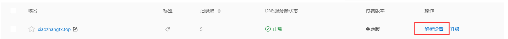
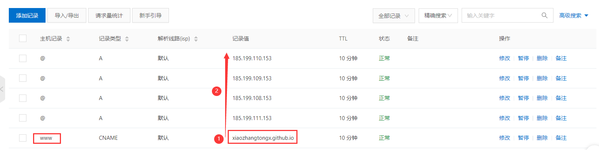
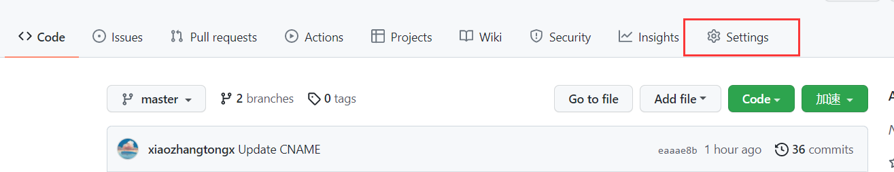
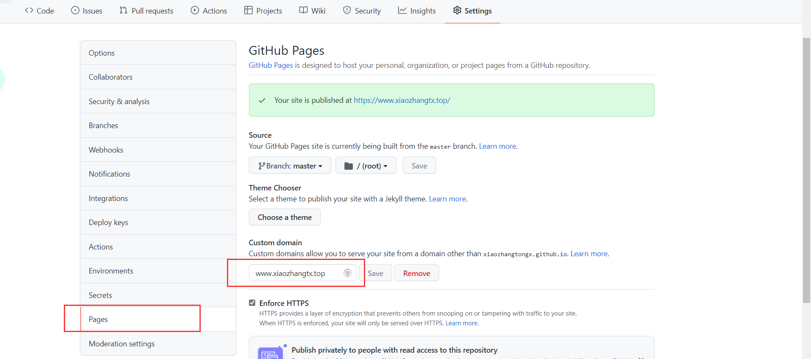
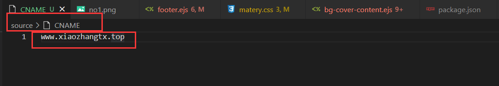
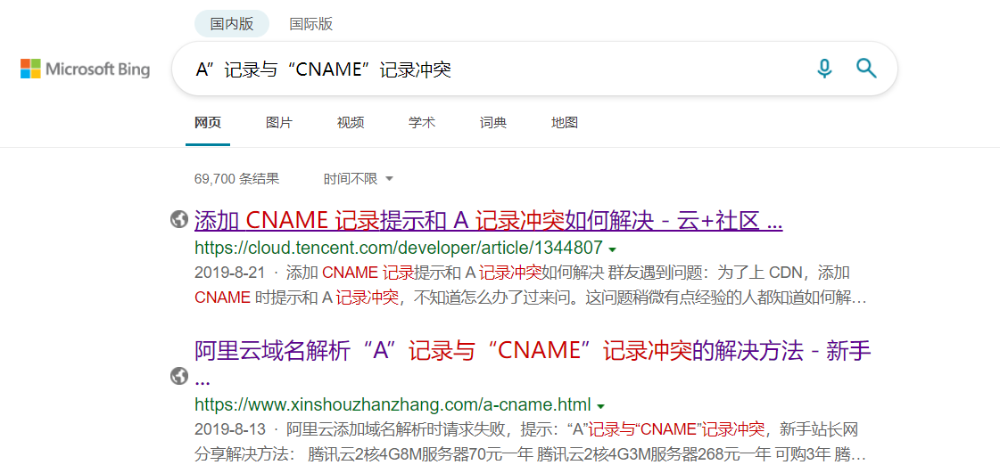

# hexo域名绑定遇到的一些问题

这几天在用阿里云的时候突然发现自己之前有买过一个域名，惊奇的发现这个域名还没有使用过，抱着“反正自己在家事情也比较少，闲着也是闲着”的态度，自己打算把之前买的那个域名与之前的个人博客绑定起来，一开始本以为域名绑定是一个特别简单的活，但是身为菜鸡的我却用了差不多一天的时间才把域名搞定，总之一句话，**菜呀！！！！**废话不多说，上干货！！！：

## 1 域名配置流程

### 1.1 域名解析

在购买域名的提供商为域名添加解析。我是在阿里云买的域名，因此我以阿里云的为例。在域名控制台选择想要绑定的域名，并点击**解析设置**



### 1.2 添加记录❗❗❗

**这里有坑！！！**  这里**一定要先添加CNAME的记录，然后再添加a类型的记录，添加a类型的记录需要有github的IP地址**，这里可以使用

```shell
ping 你的用户名.github.io
```

获得项目的IP，但是在网上为了不必要的麻烦，推荐把github的4个IP都加上，IP可以在[github文档查看](https://docs.github.com/en/pages/configuring-a-custom-domain-for-your-github-pages-site/managing-a-custom-domain-for-your-github-pages-site)

>185.199.108.153
>185.199.109.153
>185.199.110.153
>185.199.111.153



### 1.3 Github设置

- 在Github中，找到托管博客的`xxx.github.io`项目，点击`setting`

  

- 进入到设置页面，并滑动到下方，找到`Pages`这一栏，在`Custom Domain`填上刚刚添加解析的域名并保存

  

如果这里没有提示报错，**等待一会儿**就可以使用自定义的域名访问github pages所提供的页面了。

###  1.4 项目设置

看了网上的一些教程，为了防止提交一次后页面404，我们需要在项目的`source`目录下新建一个名为`CNAME`的文件。❗❗**这个文件没有后缀**❗❗，在里面添加自己的域名



## 2 遇到的问题和解决方法

### 2.1 域名解析

在域名解析的时候直接先添加了a类型的记录，结果再添加CNAME类型的记录的时候给我一直报冲突。直接整傻了去网上搜也是讲的云里雾里，最后自己修改顺序，删了一些a类型的记录后就可以了，所以要只记住顺序，还有不能重复。



### 2.2 `CNAME`文件

项目的`source`目录下新建一个名为`CNAME`的文件。❗❗**这个文件没有后缀**❗❗，在里面添加自己的域名，记住这个文件一定没有后缀！！！

### 2.3 一定要有CNAME类型的记录

一开始我原本以为只要使用github的IP，然后把这个IP添加到a类型的记录就可以了，但是回来我发现我错了，因为IP会切换，所以还是要配置CNAME类型的记录！！！！真的的搞人心态！！！！

## 3 其他

### 3.1 利用HEXO搭建个人博客

参考链接：

> https://blog.csdn.net/weixin_41287260/article/details/97691962

### 3.2 主题美化

参考链接：

> https://lovelijunyi.gitee.io/posts/b8ec.html

